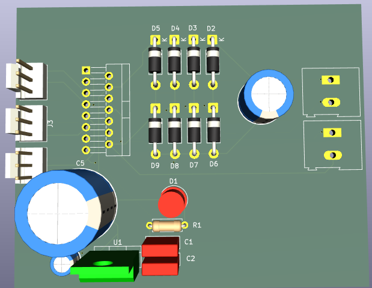

# ElectroXcape

<div align="center">



### Hackathon Project | 2nd Place Winner

A custom motor control PCB developed during a hardware hackathon, securing **2nd Place** through rapid hardware development, system design, and PCB implementation.

</div>

---

# Overview

ElectroXcape is a custom motor driver PCB developed during a hardware hackathon, where the project secured **2nd Place**.

The board is built around the L298N dual H-bridge motor driver and supports independent control of two DC motors. An onboard L7805 voltage regulator generates a regulated 5V supply from a 12V input source, while flyback protection diodes ensure safe operation during motor switching.

The project was designed entirely in KiCad and demonstrates power electronics design, motor control circuitry, schematic capture, PCB layout, and manufacturing preparation under competitive time constraints.

The project highlights rapid hardware prototyping, engineering problem-solving, and embedded system design in a hackathon environment.

---

# Achievement

🏆 Awarded **2nd Place** during a hardware-focused hackathon competition.

The project was recognized for its practical implementation, embedded hardware design approach, and rapid development workflow.

---

# Features

- L298N Dual H-Bridge Motor Driver
- Independent Control of Two DC Motors
- 12V Input Supply
- Onboard 5V Voltage Regulation
- Flyback Protection Circuitry
- Motor Enable Control
- Compact PCB Design
- Robotics Ready Architecture
- Manufacturing Ready Design

---

# PCB Preview

## Board Layout


---

# Hardware Specifications

| Parameter | Value |
|------------|---------|
| Motor Driver | L298N |
| Motor Channels | 2 |
| Input Voltage | 12V |
| Logic Supply | 5V |
| Voltage Regulator | L7805 |
| Protection | Flyback Diodes |
| PCB Layers | 2 |
| Design Tool | KiCad |
| Status | Designed & Manufacturing Ready |

---

# Working Principle

The board receives a 12V input supply and generates a regulated 5V rail using the onboard L7805 voltage regulator.

Motor control is handled by the L298N dual H-bridge driver:

### Motor A

- IN1 / IN2 → Direction Control
- EnA → Speed Control (PWM)

### Motor B

- IN3 / IN4 → Direction Control
- EnB → Speed Control (PWM)

Flyback protection diodes are included across the motor outputs to suppress back-EMF generated by inductive motor loads during switching operations.

---

# Applications

- Robotics Projects
- Line Following Robots
- Autonomous Vehicles
- Educational Motor Control Systems
- Embedded Systems Projects
- Smart Mobility Platforms
- Mechatronics Projects
- Industrial Automation Experiments

---

# Design Goals

The project was developed to:

- Create a reliable dual motor driver platform
- Practice power electronics design
- Learn motor control circuitry
- Develop hardware under hackathon constraints
- Gain experience in PCB design and routing
- Produce a manufacturing-ready PCB design

---

# Skills Demonstrated

- PCB Design
- Schematic Capture
- Power Electronics Design
- Motor Driver Integration
- Voltage Regulation Design
- Protection Circuit Design
- PCB Routing
- Design for Manufacturing (DFM)
- Engineering Problem Solving
- Rapid Hardware Prototyping

---

# Manufacturing Files

This repository contains:

- Gerber Files
- Drill Files
- PCB Images
- Design Documentation

The fabrication files can be directly uploaded to:

- JLCPCB
- PCBWay
- NextPCB
- OSH Park

---

# Repository Structure

```text
ElectroXcape/
├── README.md
├── images/
│   └── Board.png
├── docs/
│   └── Schematic.pdf
└── fabrication/
    ├── Gerber Files
    ├── Drill Files
    └── Job File
```

---

# Tools Used

- KiCad
- L298N
- L7805
- Git
- GitHub

---

# Project Status

✔ Schematic Designed

✔ PCB Layout Completed

✔ Gerber Files Generated

✔ Manufacturing Ready

🏆 2nd Place Hackathon Project

---

# Future Improvements

- Current Monitoring
- Motor Feedback Interface
- Higher Current Capability
- Compact Revision
- Reverse Polarity Protection
- Wireless Motor Control Integration

---

# License

Shared for educational and hardware development purposes.

---

<div align="center">

Designed during a Hackathon using KiCad

</div>
